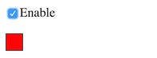

The JET/blink demo in React, with all the code running in the browser.

(based on this [examples/basic-jsx-external][BJE] sample code from React)

**Status** - Working as intended.

### Usage

```
go run server.go
open http://localhost:8000
```

Press refresh to see changes, JSX gets compiled on-the-fly in the browser.

### Output

This is what will show up in the browser:



The little square indicator blinks when the checkbox is enabled. 

[BJE]: https://github.com/facebook/react/tree/master/examples/basic-jsx-external
