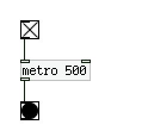

The JET/blink demo, implemented using Pure Data:

The input is a "toggle", the ticker is a "metro", the output is a "bang".

To try it out, install Pd-Extended and open the "blink6.pd" file with it.
