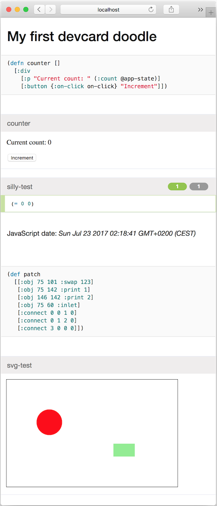

# 01-slug

A first project in Clojurescript, using Leiningen (which uses Clojure and the
JVM). Includes Figwheel (live coding), Reagent (React wrapper), and DevCards
(web-based test environment).  Based on the
[reagent-figwheel](https://github.com/gadfly361/reagent-figwheel) template.

App code is `src/slug/core.cljs`, first devcard is `src/slug/doodle.cljs`.

To start a live app, run the command below, wait a bit, then visit <http://localhost:3449/>:

    lein figwheel

Live devcards, results at <http://localhost:3449/cards.html>:

    lein figwheel devcards

Static devcards, results at `resources/public/cards.html`:

    lein cljsbuild once hostedcards

Optimised static app, results at `resources/public/index.html`:

    lein cljsbuild once min

Clean up temp files:

    lein clean

This is a Devcard screenshot, as generated by [this
code](https://github.com/jeelabs/jet/blob/d498825979ecfc63c5f326794d1c09d55b10a231/slug/src/slug/doodle.cljs):

