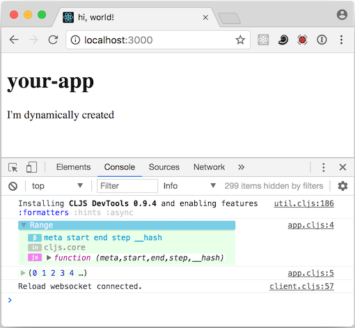

# 07-devtools

[Devtools](https://github.com/binaryage/cljs-devtools/blob/master/docs/installation.md)
is a package which lets Google Chrome display CLJS datastructures in a much
richer way in the console:

This is the file `src/your-app/app.cljs`:

    (ns your-app.app)

    (defn init []
      (.log js/console (type (range 200)))
      (.log js/console (range 200))

      (let [c (.. js/document (createElement "div"))]
        (aset c "innerHTML" "
I'm dynamically created
")
        (.. js/document (getElementById "container") (appendChild c))))

And this is the output it produces in the JavaScript console:

Note how the (potentially infinite) Clojure "seq" is properly displayed.  
Also, by using source maps, the live links on the right show CLJS code, not JS.
