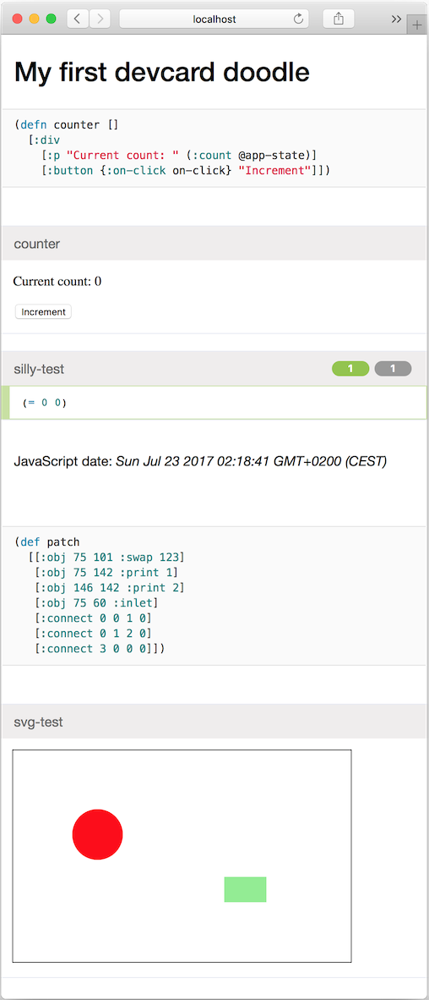

# JET/Slug

And exploration into the world of ClojureScript, Figwheel, and Reagent.

App code is `src/slug/core.cljs`, first devcard is `src/slug/doodle.cljs`.

Live app, see <http://localhost:3449/>:

    lein figwheel

Live devcards, see <http://localhost:3449/cards.html>:

    lein figwheel devcards

Static devcards, see `resources/public/cards.html`:

    lein cljsbuild once hostedcards

Static app, see `resources/public/index.html`:

    lein cljsbuild once min

Clean up temp files:

    lein clean

See https://github.com/gadfly361/reagent-figwheel on GitHub.

----

This is a Devcard screenshot, as generated by [this code](https://github.com/jeelabs/jet/blob/d498825979ecfc63c5f326794d1c09d55b10a231/slug/src/slug/doodle.cljs):

